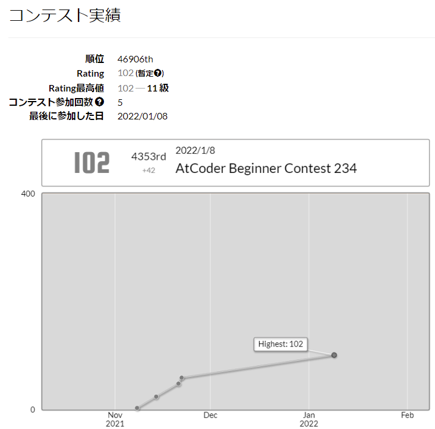

# AtCoder
## AtCoder_submission
- AtCoderのコンテストで提出したコードが入っています

- コンテスト名のフォルダに各問題の.pyファイルが入っています

- フォルダ構成(例)
  |親フォルダ|参加回フォルダ|問題ファイル
  |--|--|--
  |AtCoder_submission|ABC234|A|
  | | |B|
  | | |C|
  | | |*D以降も 解けるように なりたい*|

- **現在のRating** 
   
  まずは茶色を目指そう

## AtCoder_Beginners_Selection
- 初心者向け問題集 AtCoder Beginners Selection(https://atcoder.jp/contests/abs) の回答コードです
